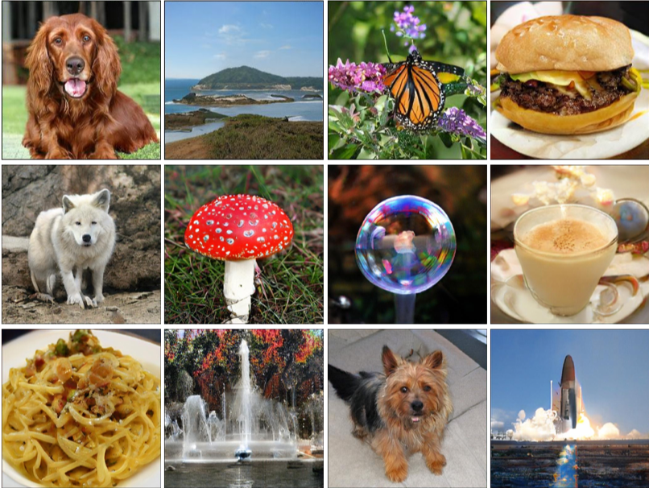
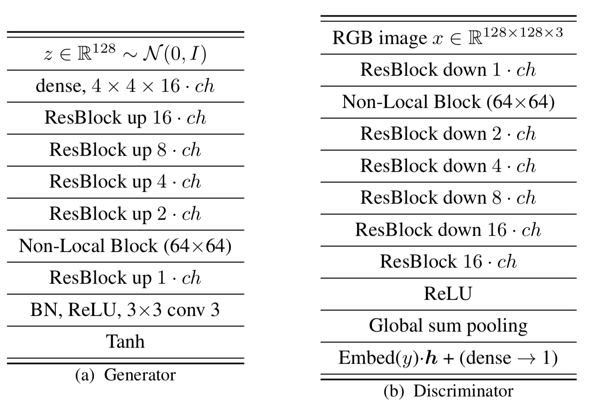
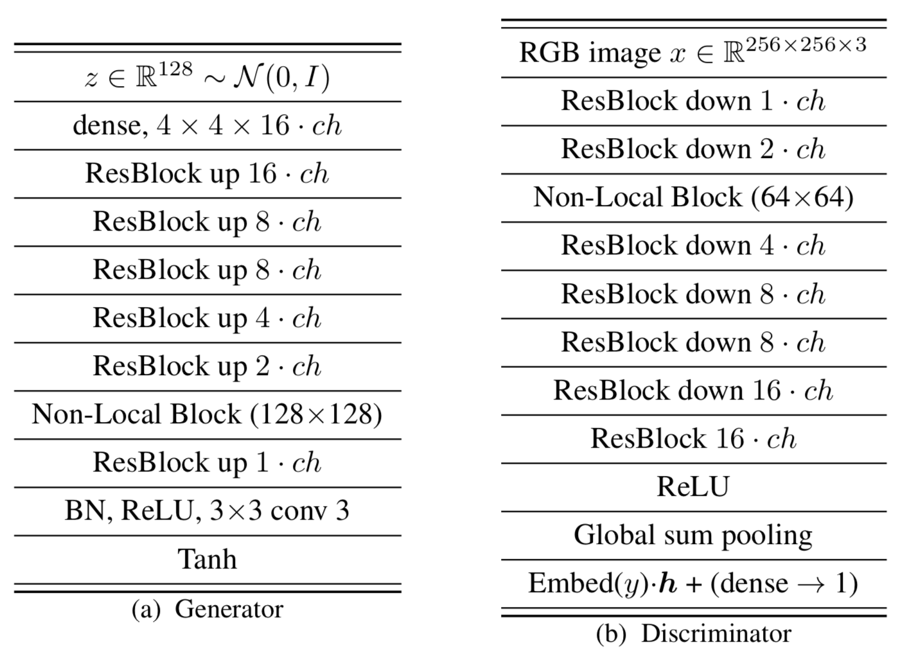
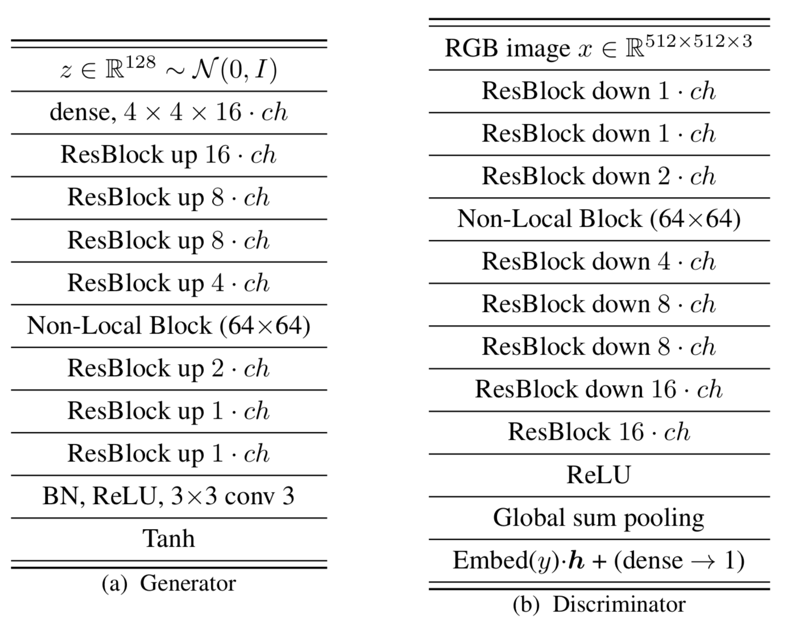

# BigGAN-Tensorflow
Simple Tensorflow implementation of ["Large Scale GAN Training for High Fidelity Natural Image Synthesis" (BigGAN)](https://arxiv.org/abs/1809.11096)



## Issue
* **The paper** used `orthogonal initialization`, but `I used random normal initialization.` The reason is, when using the orthogonal initialization, it did not train properly.

## Usage
### dataset
* `mnist` and `cifar10` are used inside keras
* For `your dataset`, put images like this:

```
├── dataset
   └── YOUR_DATASET_NAME
       ├── xxx.jpg (name, format doesn't matter)
       ├── yyy.png
       └── ...
```
### train
* python main.py --phase train --dataset celebA-HQ --gan_type hinge

### test
* python main.py --phase test --dataset celebA-HQ --gan_type hinge

## Architecture
 

### 128x128
 

### 256x256
 

### 512x512
 

## Author
Junho Kim
